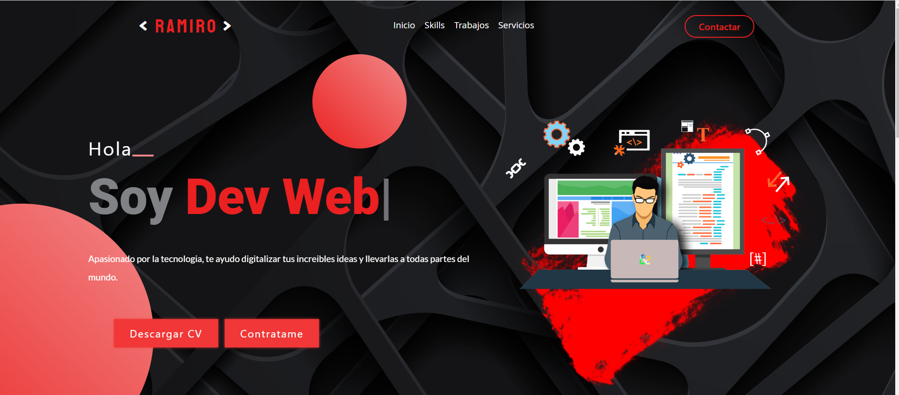

# RAMIRO - WEBSITE

- Proyecto ficticio, empleando todo lo visto en el curso de "Desarrollo Web" de CoderHouse, El proyecto es un "PORTFOLIO" de un Desarrollador Web
donde se muestran los trabajos, las habilidades, servicios, y las caracterisitcas del desarrollador.

# Tecnologias Usadas

- Este Proyecto esta hecho con:  "SCSS",  "BOOTSTRAP", "JAVASCRIPT (LIBRERIAS)" 
no tengo conocimiento de JS, sin embargo meti algunas librerias

# Herramientas

- A continuacion dejare los links de lo que use para crear este proyecto:

* IMAGENES: las imagenes fueron descargadas de estos sitios gratuitos

*https://unsplash.com/es

*https://www.flaticon.com/

*https://www.pexels.com/es-es/

* ANIMACIONES: Typing animation, es la animacion que aparece al inicio

*https://github.com/mattboldt/typed.js/: la saque de este repositorio

* GALERIA FILTRABLE: esta galeria se encuentra en la seccion "trabajos" 

*https://www.jqueryscript.net/gallery/jQuery-Plugin-For-Impressive-Galleries-With-CSS-Effects-Filterizr.html#google_vignette

* ICONOS: los iconos son de FONTAWESOME

*https://fontawesome.com/

# Despedida

Concluyo este proyecto, proyecto simple diria, soy nuevo en este mundo de la programacion y el desarollo web
seguire estudiando, y esforzandome para mejorar, y algún dia hacer este proyecto real y no ficticio.

Link proyecto: https://ramiro-website.netlify.app/

